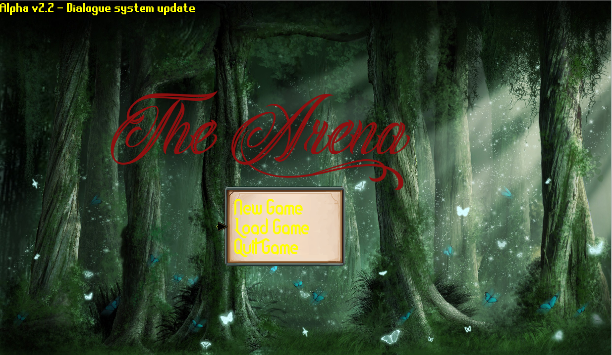
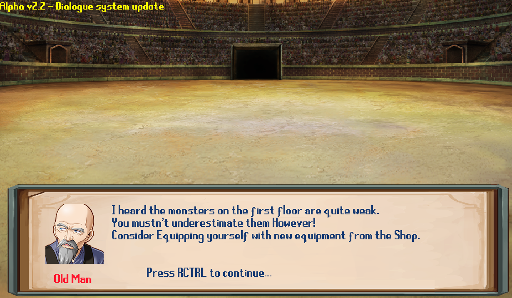
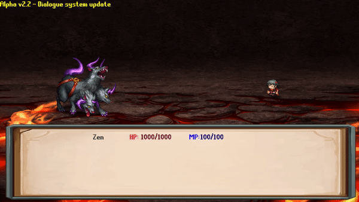

# The-Arena
An Rpg made using python and pygame.
Was made for a high school project that required the code to be in a single 'file', which resulted in the absolute monstrosity of code that you'll see. It's still very incomplete but I intend to finish it.

# Dependencies
You'll need pygame to run this.
You can learn more about pygame [here.](https://www.pygame.org)
Or just `pip install pygame`

# Instructions
Run `main.py` 

`Controls: Arrow keys for moving the cursor around, Enter to select options, RCTRL to exit out of menu or other actions as instructed.`

Read `Changelog.md` In order to see what's new after an update.
# Screenshots

## [Changelog](Changelog.md)