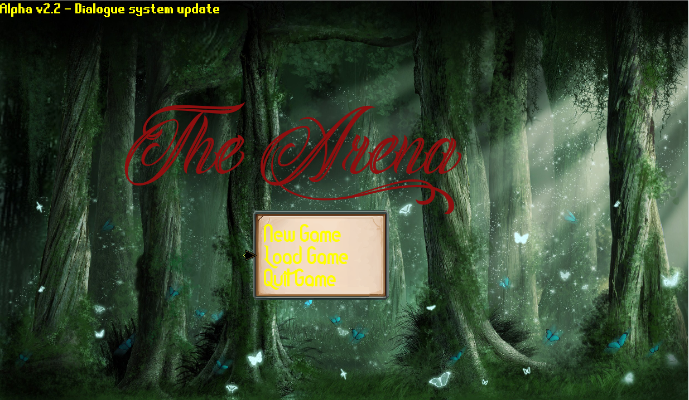
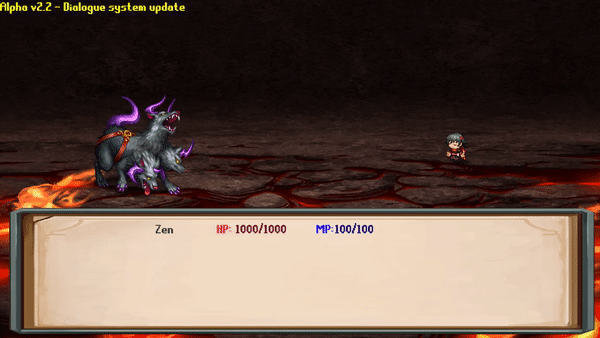

# The-Arena
An Rpg made using python and pygame.
Was made for a school project that required the code to be in a single 'file', which resulted in the absolute monstrosity of code that you'll see. It's still very incomplete but I intend to finish it.

# Dependacies
You'll need pygame to run this

# Instructions
Run 'Therpg.py'
Controls: Arrow keys for moving the cursor around, Enter to select options, RCTRL to exit out of menu or other actions as instructed.

# Screenshots

